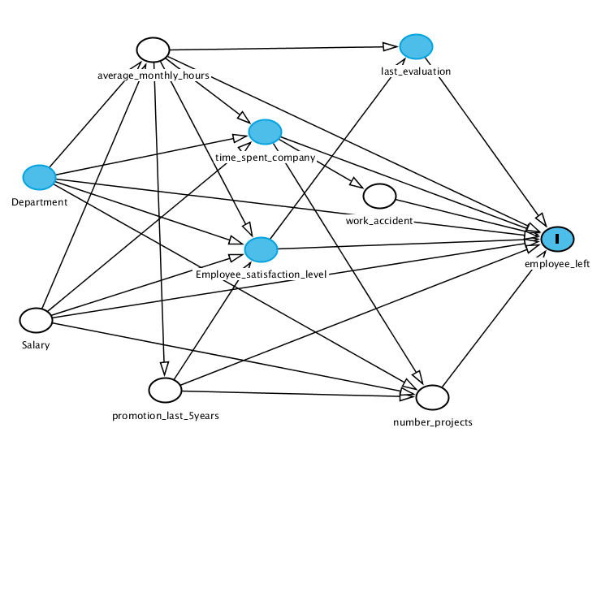

```{r}
library(scatterplot3d)
library(e1071)
library(AUC)
library(scales)
library(randomForest)
library(caret)
```
# DAG
Proposed DAG:

```{r, echo=FALSE}

```

# Exploratory Data Analysis
Load data
```{r}
dataObs = read.csv("HR_comma_sep.csv")
y = dataObs$left
data = subset(dataObs, select = -left)
```
Display class distribution
```{r}
p1 = round(mean(y == 1), 2)
p2 = round(mean(y == 0), 2)
col = c("grey50", "grey90")
ps = c(p1, p2)
pielabels = paste(ps, "%", sep="")
pie(ps, pielabels, main="Class Distribution", col=col)
legend("topright", c("0 class", "1 class"), fill=col)
```
Perform PCA
```{r}
salary = as.numeric(factor(data$salary, levels = c("low", "medium", "high")))
data.numeric = subset(data, select = -c(sales, salary))
data.numeric$salary = salary
pca = prcomp(data.numeric, center = TRUE, scale = TRUE)
cols = ifelse(y == 1, "blue", "red")
scatterplot3d(pca$x[ ,1], pca$x[ ,2], pca$x[ ,3], color=alpha(cols, 0.3), pch = 19, cex.symbols = 0.7)
```
# Modeling
```{r}
dataObs$left = factor(dataObs$left)
folds = createFolds(dataObs$left, k = 10, list = TRUE, returnTrain = FALSE)
test = dataObs[folds$Fold01, ]
test = subset(test, select = -left)
testY = dataObs[folds$Fold01, ]$left
train = dataObs[-folds$Fold01, ]
rf = randomForest(left ~., data=train, ntree=100, keep.forest=TRUE, importance = TRUE)
pred = predict(rf, newdata = test, type = "response")
mean(pred == testY)
```
```{r}
importance(rf)
```


